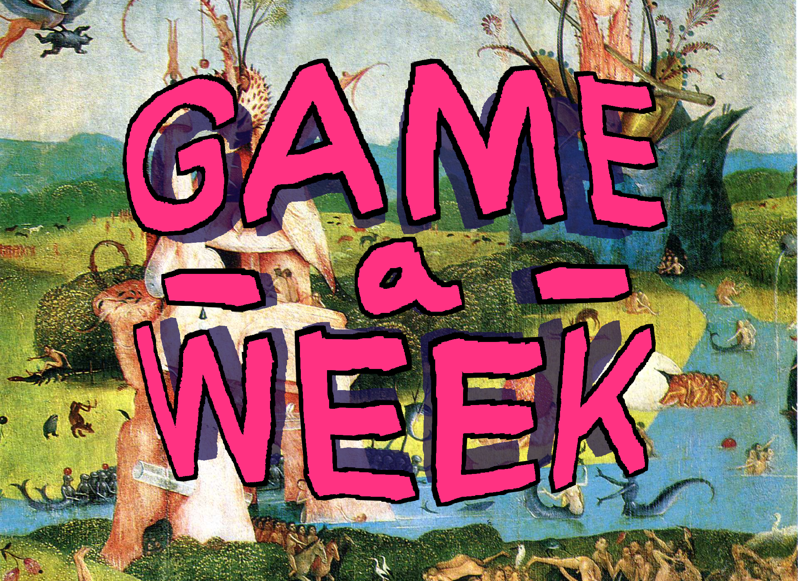
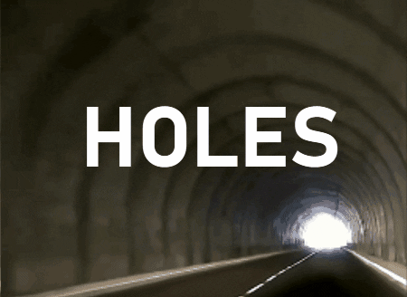
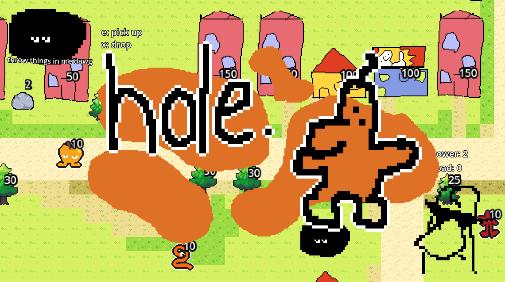
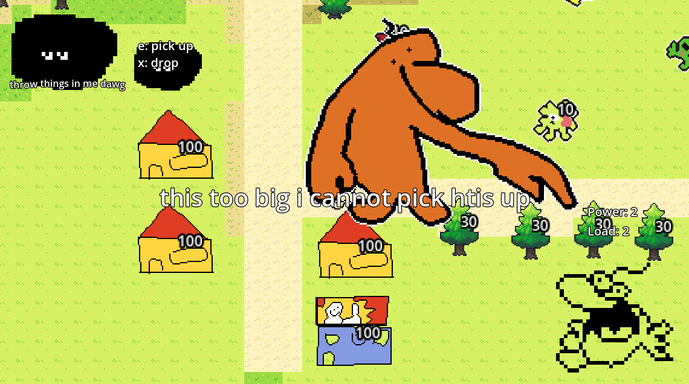
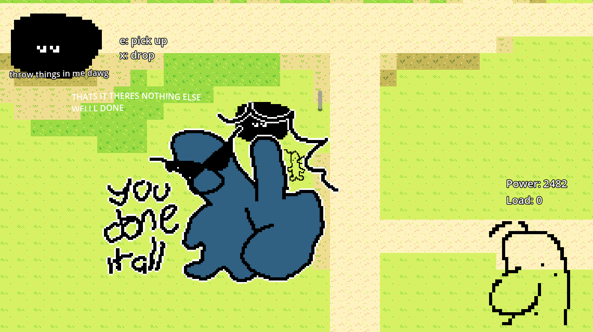

# Game-A-Week 2026: Week 6

| |  
|---|---|

> Game-A-Week is an intensive program in which participants will create 6 prototype games or works - one each week. The aims of Game-A-Week are multifaceted and center around the benefits of “sketching” - something not practiced as often in games as other arts. With your “sketches”, you’ll practice working on small scope ideas, experimenting in a low stakes and supportive environment, practice receiving feedback and help discover and develop your own taste as an artist. Drawing influence from game jams, Game-A-Week will prompt you with weekly thematic, aesthetic, or mechanical constraints (e.g. “time” or “black-and-white” or “one-button input”).

## Theme: Holes

> Holes! Falling down holes, climbing out of holes, digging holes, exploring dark depths and seeking the unknown! Holes are mysterious, sometimes large, often natural and mostly uncharted. But holes can be tiny, numerous, trypophobic, like the beehive, the anthill, or the mouse hole. Holes can be cosy and comfortable, like a burrow, or a hobbit hole. Holes can be unnatural, man made, abandoned or thoroughly used, like the tunnel, or the trap-door. A hole can represent a threshold, a hole can be an exit. 

## Game: hole?

For week 6 I created a Katamari Damacy style throw-things-down-a-hole power-scaling object collection game. The more you pick up and throw, the more you can pick up. What's in the hole? How's this fella so strong? Why's the tilemap so small and empty? Maybe I'll kick your ass, chump.

I ended up putting myself on a stupid time-crunch with this one, with only roughly a day to work on this game. I feel like this pretty heavily influenced the dodgy, scratchy, sketchy cartoon style I went with. But also, I just kind of draw assets like this pretty often at this point. I had a few people come up during the showcase and say they recognised it was my game without even being told, which was very sweet and maybe I am too predictable. I need to make a dark horror game next. 

Despite how dodgy the game looks I think its quite charming. It also afforded me a lot of time, since I could comfortably blast out assets as needed in a few seconds. I reused a bunch of assets from other games ([1](https://umconfortable.itch.io/what), [2](https://umconfortable.itch.io/disco)), which I don't do super often. 

The UI is odd. I still dont know much about UI, but its servicable. I personally love the obnoxious UI popups when an object is too heavy to pick up, as well as when you finish the game. The images are stupidly big and uncomfortably placed. The idea of the character pointing you to the statistics on screen, almost judgementally, makes me laugh. 

The character is orange in two textures. this is not canon.

I was looking to add a couple of additional features, such as a timer, and being able to ultimately pick up and throw the whole tilemap, but left them out since I only worked on this game on about one day out of the whole week. I also initially considered that there would be more dialogue from the hole, but didn't want to spend the time shoving a dialogue system in, and writing something I'd be happy with. I also wanted to make stickers of the end "you done it" image, but my printer is busted!! maybe another day. 

This is the last Game A Week for this year, which is very sad!! Also only the second one that I showcased, with a few other weeks never being finished. Hopefully I can go back and bulk those ones up eventually. Bye!!!

## Acknowledgements
Thanks to
* various free sound effects youtube channels
* various malware riddled youtube to mp3 websites
* my friends i love you